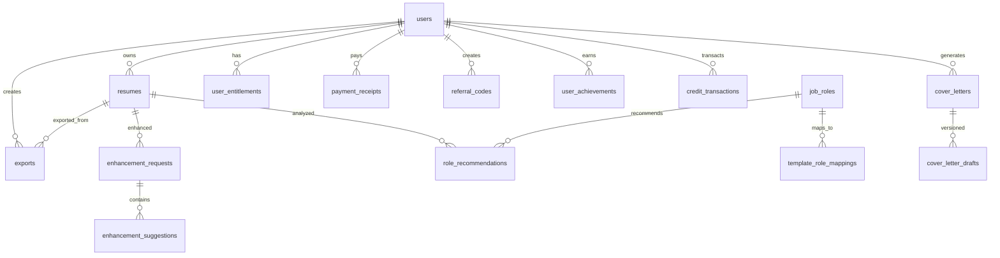

# Database Schema Documentation

Complete database design and architecture for SexyResume.com.

## 🏗️ **Database Architecture Overview**

### **Technology Stack**
- **Database**: PostgreSQL 15+ with vector extensions
- **ORM**: Supabase client with TypeScript
- **Security**: Row Level Security (RLS) on all tables
- **Extensions**: pgvector for AI embeddings, uuid-ossp for UUIDs

### **Schema Design Principles**
- **Data Normalization**: 3NF compliance with strategic denormalization
- **Security First**: RLS policies on every table
- **Performance**: Strategic indexing and query optimization
- **Scalability**: Partitioning for large analytics tables
- **Compliance**: GDPR-ready with automatic data retention

---

## 📊 **Core Entity Relationships**



---

## 🗃️ **Table Specifications**

### **Core User Management**

#### `public.users`
```sql
CREATE TABLE public.users (
  id uuid PRIMARY KEY DEFAULT gen_random_uuid(),
  email text UNIQUE NOT NULL,
  full_name text,
  created_at timestamptz DEFAULT now(),
  updated_at timestamptz DEFAULT now()
);
```

**Indexes:**
- `idx_users_email` - Unique constraint and login lookup
- `idx_users_created_at` - Cohort analysis and user growth metrics

**RLS Policies:**
- Users can read/update their own profile only
- Service role has full access for admin operations

#### `public.resumes`
```sql
CREATE TABLE public.resumes (
  id uuid PRIMARY KEY DEFAULT gen_random_uuid(),
  user_id uuid NOT NULL REFERENCES public.users(id) ON DELETE CASCADE,
  title text NOT NULL DEFAULT 'My Resume',
  data jsonb NOT NULL DEFAULT '{}',
  template text NOT NULL DEFAULT 'modern',
  is_active boolean DEFAULT true,
  created_at timestamptz DEFAULT now(),
  updated_at timestamptz DEFAULT now()
);
```

**JSON Schema for `data` field:**
```typescript
interface ResumeData {
  personalInfo: {
    fullName: string;
    email: string;
    phone: string;
    location: string;
    linkedin?: string;
    website?: string;
    summary: string;
  };
  experience: Array<{
    id: string;
    company: string;
    position: string;
    startDate: string; // YYYY-MM format
    endDate: string;
    current: boolean;
    description: string;
    achievements: string[];
  }>;
  education: Array<{
    id: string;
    institution: string;
    degree: string;
    field: string;
    startDate: string;
    endDate: string;
    gpa?: string;
    honors?: string;
  }>;
  skills: Array<{
    id: string;
    name: string;
    level: 'Beginner' | 'Intermediate' | 'Advanced' | 'Expert';
    category: 'Technical' | 'Soft' | 'Language' | 'Other';
  }>;
  projects: Array<{
    id: string;
    name: string;
    description: string;
    technologies: string[];
    url?: string;
    startDate: string;
    endDate: string;
  }>;
}
```

---

### **AI Enhancement System**

#### `public.enhancement_requests`
```sql
CREATE TABLE public.enhancement_requests (
  id uuid PRIMARY KEY DEFAULT gen_random_uuid(),
  user_id uuid NOT NULL REFERENCES public.users(id) ON DELETE CASCADE,
  resume_id uuid REFERENCES public.resumes(id) ON DELETE CASCADE,
  target_role text,
  target_industry text,
  tone_preset text NOT NULL CHECK (tone_preset IN ('executive', 'professional', 'creative', 'technical', 'entry_level')),
  style_preferences jsonb DEFAULT '{}',
  original_content jsonb NOT NULL,
  enhanced_content jsonb,
  overall_confidence numeric(3,2) DEFAULT 0.0,
  processing_status text CHECK (processing_status IN ('pending', 'processing', 'completed', 'failed')),
  processing_time_ms integer,
  token_usage integer,
  error_message text,
  created_at timestamptz DEFAULT now(),
  completed_at timestamptz
);
```

**Business Rules:**
- Users limited to 10 enhancement requests per day (free tier)
- Premium users get unlimited enhancements
- Token usage tracked for cost optimization
- Failed requests don't count against limits

#### `public.enhancement_suggestions`
```sql
CREATE TABLE public.enhancement_suggestions (
  id uuid PRIMARY KEY DEFAULT gen_random_uuid(),
  request_id uuid NOT NULL REFERENCES public.enhancement_requests(id) ON DELETE CASCADE,
  section_type text NOT NULL,
  section_id text NOT NULL,
  field_path text NOT NULL,
  original_text text NOT NULL,
  suggested_text text NOT NULL,
  improvement_type text NOT NULL,
  confidence numeric(3,2) NOT NULL DEFAULT 0.0,
  reasoning text,
  metrics jsonb DEFAULT '{}',
  user_action text CHECK (user_action IN ('pending', 'accepted', 'rejected', 'modified')),
  user_modified_text text,
  applied_at timestamptz,
  created_at timestamptz DEFAULT now()
);
```

---

### **Job Matching System**

#### `public.job_roles`
```sql
CREATE TABLE public.job_roles (
  id uuid PRIMARY KEY DEFAULT gen_random_uuid(),
  title text NOT NULL,
  normalized_title text NOT NULL,
  industry_category text NOT NULL,
  seniority_level text NOT NULL CHECK (seniority_level IN ('entry', 'mid', 'senior', 'executive', 'c_level')),
  required_skills text[] DEFAULT '{}',
  preferred_skills text[] DEFAULT '{}',
  typical_experience_years integer,
  salary_range_min integer,
  salary_range_max integer,
  growth_outlook text CHECK (growth_outlook IN ('declining', 'stable', 'growing', 'high_growth')),
  remote_friendly boolean DEFAULT false,
  description text,
  key_responsibilities text[],
  embedding vector(1536), -- OpenAI ada-002 embeddings
  popularity_score numeric(3,2) DEFAULT 0.0,
  created_at timestamptz DEFAULT now(),
  updated_at timestamptz DEFAULT now()
);
```

**Vector Search Performance:**
- Uses pgvector extension for similarity search
- Embeddings generated via OpenAI ada-002 model
- Indexed with HNSW for sub-linear search performance
- Batch embedding updates for cost efficiency

#### `public.role_recommendations`
```sql
CREATE TABLE public.role_recommendations (
  id uuid PRIMARY KEY DEFAULT gen_random_uuid(),
  user_id uuid NOT NULL REFERENCES public.users(id) ON DELETE CASCADE,
  resume_id uuid REFERENCES public.resumes(id) ON DELETE CASCADE,
  job_role_id uuid NOT NULL REFERENCES public.job_roles(id),
  match_score numeric(3,2) NOT NULL,
  confidence_level text NOT NULL CHECK (confidence_level IN ('low', 'medium', 'high', 'very_high')),
  reasoning text NOT NULL,
  matched_skills text[] DEFAULT '{}',
  skill_gaps text[] DEFAULT '{}',
  recommended_template text,
  highlight_sections text[] DEFAULT '{}',
  user_feedback text CHECK (user_feedback IN ('interested', 'not_interested', 'applied', 'hired')),
  feedback_notes text,
  created_at timestamptz DEFAULT now(),
  updated_at timestamptz DEFAULT now()
);
```

---

### **Growth & Monetization**

#### `public.referral_codes`
```sql
CREATE TABLE public.referral_codes (
  id uuid PRIMARY KEY DEFAULT gen_random_uuid(),
  user_id uuid NOT NULL REFERENCES public.users(id) ON DELETE CASCADE,
  code text NOT NULL UNIQUE,
  is_active boolean DEFAULT true,
  usage_count integer DEFAULT 0,
  max_uses integer DEFAULT 100,
  reward_type text NOT NULL CHECK (reward_type IN ('credits', 'discount', 'feature_unlock')),
  reward_amount integer NOT NULL DEFAULT 1,
  expires_at timestamptz,
  created_at timestamptz DEFAULT now(),
  updated_at timestamptz DEFAULT now()
);
```

**Code Generation Algorithm:**
```sql
CREATE OR REPLACE FUNCTION generate_referral_code(p_user_id uuid)
RETURNS text AS $$
DECLARE
  code text;
  code_exists boolean;
BEGIN
  LOOP
    -- Generate 8-character alphanumeric code
    code := upper(substring(md5(random()::text || p_user_id::text) from 1 for 8));
    
    -- Check uniqueness
    SELECT EXISTS(SELECT 1 FROM referral_codes WHERE code = code) INTO code_exists;
    
    EXIT WHEN NOT code_exists;
  END LOOP;
  
  RETURN code;
END;
$$ LANGUAGE plpgsql SECURITY DEFINER;
```

#### `public.user_achievements`
```sql
CREATE TABLE public.user_achievements (
  id uuid PRIMARY KEY DEFAULT gen_random_uuid(),
  user_id uuid NOT NULL REFERENCES public.users(id) ON DELETE CASCADE,
  achievement_key text NOT NULL,
  earned_at timestamptz DEFAULT now(),
  progress_data jsonb DEFAULT '{}',
  credits_awarded integer DEFAULT 0,
  credits_claimed boolean DEFAULT false,
  created_at timestamptz DEFAULT now(),
  UNIQUE(user_id, achievement_key)
);
```

---

### **Analytics & Observability**

#### `public.analytics_events`
```sql
CREATE TABLE public.analytics_events (
  id uuid PRIMARY KEY DEFAULT gen_random_uuid(),
  event_name text NOT NULL,
  properties jsonb DEFAULT '{}', -- No PII stored
  session_id text,
  timestamp timestamptz NOT NULL,
  created_at timestamptz DEFAULT now()
);
```

**PII Sanitization Rules:**
```typescript
const PII_FIELDS = [
  'email', 'phone', 'fullName', 'name', 'address', 'location',
  'personalInfo', 'userData', 'userEmail', 'userName'
];

export function sanitizeAnalyticsProperties(properties: Record<string, any>): Record<string, any> {
  const sanitized = { ...properties };
  
  PII_FIELDS.forEach(field => {
    delete sanitized[field];
  });
  
  // Recursively sanitize nested objects
  Object.keys(sanitized).forEach(key => {
    if (typeof sanitized[key] === 'object' && sanitized[key] !== null) {
      sanitized[key] = sanitizeAnalyticsProperties(sanitized[key]);
    }
  });
  
  return sanitized;
}
```

#### `public.cohort_analysis`
```sql
CREATE TABLE public.cohort_analysis (
  id uuid PRIMARY KEY DEFAULT gen_random_uuid(),
  cohort_period text NOT NULL, -- 'weekly', 'monthly'
  cohort_date date NOT NULL,
  period_number integer NOT NULL, -- 0, 1, 2, 3... periods since signup
  user_count integer NOT NULL,
  retained_users integer NOT NULL,
  retention_rate numeric(5,2) NOT NULL,
  revenue_total integer DEFAULT 0,
  revenue_per_user numeric(10,2) DEFAULT 0,
  computed_at timestamptz DEFAULT now(),
  UNIQUE(cohort_period, cohort_date, period_number)
);
```

---

## 🔐 **Security Model**

### **Row Level Security (RLS) Patterns**

#### **User Data Isolation**
```sql
-- Standard user data policy
CREATE POLICY "users_own_data_only"
  ON table_name
  FOR ALL
  TO authenticated
  USING (auth.uid() = user_id);
```

#### **Admin Access Patterns**
```sql
-- Admin read access
CREATE POLICY "admins_can_read"
  ON table_name
  FOR SELECT
  TO authenticated
  USING (
    EXISTS (
      SELECT 1 FROM admin_users 
      WHERE user_id = auth.uid() 
      AND role IN ('admin', 'super_admin') 
      AND is_active = true
    )
  );
```

#### **Service Role Patterns**
```sql
-- Service role full access
CREATE POLICY "service_role_full_access"
  ON table_name
  FOR ALL
  TO service_role
  USING (true);
```

### **Data Retention Policies**

#### **Automatic Cleanup Rules**
```sql
-- Data retention policies
INSERT INTO data_retention_policies (table_name, retention_days, soft_delete) VALUES
  ('exports', 1, false),              -- Delete export files after 24 hours
  ('resumes', 365, true),             -- Soft delete inactive resumes after 1 year
  ('cover_letters', 365, true),       -- Soft delete inactive cover letters after 1 year
  ('payment_receipts', 2555, false),  -- Keep payment records for 7 years (legal)
  ('audit_logs', 1095, false),        -- Archive audit logs after 3 years
  ('analytics_events', 730, false);   -- Delete analytics after 2 years
```

#### **Purge Job Execution**
```sql
-- Automated purge function
CREATE OR REPLACE FUNCTION execute_data_purge()
RETURNS jsonb AS $$
DECLARE
  policy_record RECORD;
  total_deleted integer := 0;
BEGIN
  FOR policy_record IN 
    SELECT * FROM data_retention_policies WHERE is_active = true
  LOOP
    -- Execute purge based on policy
    CASE policy_record.table_name
      WHEN 'exports' THEN
        -- Delete expired export files and records
        DELETE FROM exports WHERE expires_at < now();
      WHEN 'resumes' THEN
        -- Soft delete inactive resumes
        UPDATE resumes SET deleted_at = now() 
        WHERE updated_at < now() - (policy_record.retention_days || ' days')::interval
        AND deleted_at IS NULL;
      -- Additional cases for other tables...
    END CASE;
  END LOOP;
  
  RETURN jsonb_build_object('deleted_records', total_deleted);
END;
$$ LANGUAGE plpgsql SECURITY DEFINER;
```

---

## 📈 **Performance Optimization**

### **Indexing Strategy**

#### **Primary Indexes**
```sql
-- User lookup optimization
CREATE INDEX idx_users_email ON users(email);
CREATE INDEX idx_users_created_at ON users(created_at DESC);

-- Resume queries
CREATE INDEX idx_resumes_user_id ON resumes(user_id);
CREATE INDEX idx_resumes_updated_at ON resumes(updated_at DESC);
CREATE INDEX idx_resumes_template ON resumes(template);

-- Export tracking
CREATE INDEX idx_exports_user_id ON exports(user_id);
CREATE INDEX idx_exports_expires_at ON exports(expires_at);
CREATE INDEX idx_exports_created_at ON exports(created_at DESC);

-- Analytics performance
CREATE INDEX idx_analytics_events_event_name ON analytics_events(event_name);
CREATE INDEX idx_analytics_events_timestamp ON analytics_events(timestamp DESC);
CREATE INDEX idx_analytics_events_session_id ON analytics_events(session_id);
```

#### **Composite Indexes**
```sql
-- Multi-column indexes for complex queries
CREATE INDEX idx_role_recommendations_user_score ON role_recommendations(user_id, match_score DESC);
CREATE INDEX idx_enhancement_requests_user_status ON enhancement_requests(user_id, processing_status);
CREATE INDEX idx_credit_transactions_user_type_date ON credit_transactions(user_id, transaction_type, created_at DESC);
```

#### **Vector Indexes**
```sql
-- Vector similarity search optimization
CREATE INDEX idx_job_roles_embedding ON job_roles USING hnsw (embedding vector_cosine_ops);
```

### **Query Optimization Patterns**

#### **Efficient User Data Queries**
```sql
-- Get user with all related data (single query)
CREATE VIEW user_dashboard_data AS
SELECT 
  u.*,
  (SELECT COUNT(*) FROM resumes WHERE user_id = u.id AND deleted_at IS NULL) as resume_count,
  (SELECT COUNT(*) FROM exports WHERE user_id = u.id) as export_count,
  (SELECT export_unlocked FROM user_entitlements WHERE user_id = u.id) as export_unlocked,
  (SELECT SUM(amount) FROM credit_transactions WHERE user_id = u.id) as credit_balance
FROM users u;
```

#### **Analytics Aggregation Queries**
```sql
-- Pre-computed daily metrics
CREATE MATERIALIZED VIEW daily_metrics AS
SELECT 
  date_trunc('day', created_at) as date,
  COUNT(*) as signups,
  COUNT(*) FILTER (WHERE created_at >= CURRENT_DATE - INTERVAL '7 days') as weekly_signups,
  COUNT(DISTINCT CASE WHEN export_count > 0 THEN user_id END) as activated_users
FROM user_dashboard_data
GROUP BY date_trunc('day', created_at);

-- Refresh schedule: Every hour
SELECT cron.schedule('refresh-daily-metrics', '0 * * * *', 'REFRESH MATERIALIZED VIEW daily_metrics;');
```

---

## 🔄 **Data Migration Strategy**

### **Migration File Organization**
```
supabase/migrations/
├── 20250926165411_azure_pebble.sql      # Core auth and resume schema
├── 20250927105340_holy_meadow.sql       # Cover letter system
├── 20250927112956_heavy_recipe.sql      # Payment system
├── 20250927115808_dawn_frost.sql        # Stripe integration
├── 20250927123118_steep_bush.sql        # Analytics and observability
├── 20250927130513_heavy_delta.sql       # Admin and audit system
├── 20250927150311_shy_hall.sql          # Data lifecycle management
├── 20250927165407_curly_hall.sql        # AI enhancement system
├── 20250927173835_bronze_violet.sql     # Job matching system
├── 20250927181213_sweet_snowflake.sql   # Analytics dashboard
└── 20250927182013_light_recipe.sql      # Growth and monetization
```

### **Migration Best Practices**
- **Idempotent Operations**: All migrations use `IF NOT EXISTS` and `ON CONFLICT`
- **Rollback Safety**: No destructive operations without explicit approval
- **Performance Aware**: Indexes created concurrently to avoid locks
- **Security First**: RLS enabled immediately after table creation

### **Schema Evolution Rules**
```sql
-- Safe column additions
ALTER TABLE table_name ADD COLUMN IF NOT EXISTS new_column text;

-- Safe index creation
CREATE INDEX CONCURRENTLY IF NOT EXISTS idx_name ON table_name(column);

-- Safe constraint additions
DO $$
BEGIN
  IF NOT EXISTS (
    SELECT 1 FROM information_schema.table_constraints 
    WHERE constraint_name = 'constraint_name'
  ) THEN
    ALTER TABLE table_name ADD CONSTRAINT constraint_name CHECK (condition);
  END IF;
END $$;
```

---

## 🎯 **Business Logic Functions**

### **Credit System Functions**
```sql
-- Award credits with transaction logging
CREATE OR REPLACE FUNCTION award_credits(
  p_user_id uuid,
  p_amount integer,
  p_source text,
  p_description text
)
RETURNS void AS $$
DECLARE
  current_balance integer := 0;
BEGIN
  -- Get current balance
  SELECT COALESCE(SUM(amount), 0) INTO current_balance
  FROM credit_transactions WHERE user_id = p_user_id;
  
  -- Insert transaction
  INSERT INTO credit_transactions (
    user_id, transaction_type, amount, source, description, balance_after
  ) VALUES (
    p_user_id, 'earned', p_amount, p_source, p_description, current_balance + p_amount
  );
END;
$$ LANGUAGE plpgsql SECURITY DEFINER;

-- Spend credits with validation
CREATE OR REPLACE FUNCTION spend_credits(
  p_user_id uuid,
  p_amount integer,
  p_source text,
  p_description text
)
RETURNS boolean AS $$
DECLARE
  current_balance integer := 0;
BEGIN
  -- Check balance
  SELECT COALESCE(SUM(amount), 0) INTO current_balance
  FROM credit_transactions WHERE user_id = p_user_id;
  
  IF current_balance < p_amount THEN
    RETURN false;
  END IF;
  
  -- Deduct credits
  INSERT INTO credit_transactions (
    user_id, transaction_type, amount, source, description, balance_after
  ) VALUES (
    p_user_id, 'spent', -p_amount, p_source, p_description, current_balance - p_amount
  );
  
  RETURN true;
END;
$$ LANGUAGE plpgsql SECURITY DEFINER;
```

### **Achievement Processing Functions**
```sql
-- Check and award achievements
CREATE OR REPLACE FUNCTION check_achievements(
  p_user_id uuid,
  p_event_data jsonb
)
RETURNS jsonb AS $$
DECLARE
  achievement_record RECORD;
  awarded_achievements text[] := '{}';
  total_credits integer := 0;
BEGIN
  -- Check each unearned achievement
  FOR achievement_record IN 
    SELECT * FROM achievement_definitions 
    WHERE is_active = true
    AND achievement_key NOT IN (
      SELECT achievement_key FROM user_achievements WHERE user_id = p_user_id
    )
  LOOP
    -- Evaluate criteria (simplified)
    IF evaluate_achievement_criteria(achievement_record.criteria, p_event_data) THEN
      -- Award achievement
      INSERT INTO user_achievements (user_id, achievement_key, credits_awarded)
      VALUES (p_user_id, achievement_record.achievement_key, achievement_record.reward_credits);
      
      -- Award credits
      PERFORM award_credits(
        p_user_id, 
        achievement_record.reward_credits, 
        'achievement', 
        'Achievement: ' || achievement_record.title
      );
      
      awarded_achievements := awarded_achievements || achievement_record.achievement_key;
      total_credits := total_credits + achievement_record.reward_credits;
    END IF;
  END LOOP;
  
  RETURN jsonb_build_object(
    'achievements_awarded', awarded_achievements,
    'total_credits_awarded', total_credits
  );
END;
$$ LANGUAGE plpgsql SECURITY DEFINER;
```

---

## 📊 **Analytics Data Model**

### **Event Tracking Schema**
```typescript
interface AnalyticsEvent {
  eventName: string;
  properties: Record<string, any>; // Sanitized, no PII
  sessionId: string;
  timestamp: string;
  userId?: string; // Optional for anonymous events
}

// Event naming convention
const EVENT_NAMING = {
  // User actions
  'user_signed_up': { category: 'auth', action: 'signup' },
  'resume_created': { category: 'resume', action: 'create' },
  'template_selected': { category: 'template', action: 'select' },
  'export_completed': { category: 'export', action: 'complete' },
  
  // AI interactions
  'ai_enhancement_started': { category: 'ai', action: 'enhance_start' },
  'ai_enhancement_completed': { category: 'ai', action: 'enhance_complete' },
  'job_match_requested': { category: 'ai', action: 'job_match' },
  
  // Growth events
  'referral_sent': { category: 'growth', action: 'referral_send' },
  'achievement_earned': { category: 'growth', action: 'achievement' },
  'upsell_shown': { category: 'growth', action: 'upsell_display' },
  'upsell_converted': { category: 'growth', action: 'upsell_convert' }
};
```

### **Funnel Analysis Schema**
```sql
-- Conversion funnel tracking
CREATE TABLE funnel_analytics (
  id uuid PRIMARY KEY DEFAULT gen_random_uuid(),
  funnel_name text NOT NULL,
  step_name text NOT NULL,
  user_id uuid,
  properties jsonb DEFAULT '{}',
  timestamp timestamptz NOT NULL,
  created_at timestamptz DEFAULT now()
);

-- Pre-defined funnels
INSERT INTO conversion_funnels (funnel_name, steps) VALUES
('user_onboarding', '[
  {"step": "signup", "name": "Account Creation"},
  {"step": "resume_upload", "name": "Resume Upload"},
  {"step": "template_selection", "name": "Template Selection"},
  {"step": "content_completion", "name": "Content Completion"},
  {"step": "first_export", "name": "First Export"}
]'),
('export_conversion', '[
  {"step": "resume_complete", "name": "Resume Complete"},
  {"step": "export_attempt", "name": "Export Attempt"},
  {"step": "payment_page", "name": "Payment Page"},
  {"step": "payment_complete", "name": "Payment Complete"},
  {"step": "export_download", "name": "Export Download"}
]');
```

---

## 🚀 **Scaling Considerations**

### **Database Partitioning**
```sql
-- Partition analytics tables by date for performance
CREATE TABLE analytics_events_y2024m01 PARTITION OF analytics_events
FOR VALUES FROM ('2024-01-01') TO ('2024-02-01');

CREATE TABLE analytics_events_y2024m02 PARTITION OF analytics_events
FOR VALUES FROM ('2024-02-01') TO ('2024-03-01');

-- Automatic partition creation
CREATE OR REPLACE FUNCTION create_monthly_partition(table_name text, start_date date)
RETURNS void AS $$
DECLARE
  partition_name text;
  end_date date;
BEGIN
  partition_name := table_name || '_y' || to_char(start_date, 'YYYY') || 'm' || to_char(start_date, 'MM');
  end_date := start_date + interval '1 month';
  
  EXECUTE format('CREATE TABLE %I PARTITION OF %I FOR VALUES FROM (%L) TO (%L)',
    partition_name, table_name, start_date, end_date);
END;
$$ LANGUAGE plpgsql;
```

### **Connection Pooling**
```typescript
// Supabase client configuration for high load
const supabaseConfig = {
  auth: {
    autoRefreshToken: true,
    persistSession: true,
    detectSessionInUrl: false
  },
  db: {
    schema: 'public'
  },
  global: {
    headers: {
      'x-application-name': 'sexyresume-web'
    }
  }
};

// Connection pooling for edge functions
const createPooledClient = () => {
  return createClient(
    process.env.SUPABASE_URL!,
    process.env.SUPABASE_SERVICE_ROLE_KEY!,
    {
      ...supabaseConfig,
      auth: {
        autoRefreshToken: false,
        persistSession: false
      }
    }
  );
};
```

---

## 🔍 **Query Examples**

### **Complex Business Queries**

#### **User Growth Analysis**
```sql
-- Monthly user growth with cohort retention
WITH monthly_signups AS (
  SELECT 
    date_trunc('month', created_at) as signup_month,
    COUNT(*) as new_users
  FROM users
  WHERE created_at >= CURRENT_DATE - INTERVAL '12 months'
  GROUP BY date_trunc('month', created_at)
),
monthly_retention AS (
  SELECT 
    date_trunc('month', u.created_at) as signup_month,
    COUNT(DISTINCT CASE WHEN ae.timestamp >= u.created_at + INTERVAL '30 days' 
                        AND ae.timestamp < u.created_at + INTERVAL '60 days'
                        THEN u.id END) as retained_users
  FROM users u
  LEFT JOIN analytics_events ae ON ae.properties->>'user_id' = u.id::text
  WHERE u.created_at >= CURRENT_DATE - INTERVAL '12 months'
  GROUP BY date_trunc('month', u.created_at)
)
SELECT 
  s.signup_month,
  s.new_users,
  r.retained_users,
  ROUND((r.retained_users::numeric / s.new_users * 100), 2) as retention_rate
FROM monthly_signups s
LEFT JOIN monthly_retention r ON s.signup_month = r.signup_month
ORDER BY s.signup_month;
```

#### **Revenue Attribution Analysis**
```sql
-- Revenue attribution by acquisition channel
WITH user_attribution AS (
  SELECT 
    u.id as user_id,
    u.created_at,
    COALESCE(
      CASE WHEN rc.code IS NOT NULL THEN 'referral'
           WHEN u.created_at::time BETWEEN '09:00' AND '17:00' THEN 'organic_business_hours'
           ELSE 'organic_other' END,
      'direct'
    ) as acquisition_channel,
    rc.code as referral_code
  FROM users u
  LEFT JOIN referral_conversions rcv ON rcv.referred_user_id = u.id
  LEFT JOIN referral_codes rc ON rc.code = rcv.referral_code
),
revenue_by_channel AS (
  SELECT 
    ua.acquisition_channel,
    COUNT(DISTINCT ua.user_id) as users,
    COUNT(DISTINCT pr.user_id) as paying_users,
    COALESCE(SUM(pr.amount), 0) as total_revenue,
    ROUND(AVG(pr.amount), 2) as avg_revenue_per_paying_user
  FROM user_attribution ua
  LEFT JOIN payment_receipts pr ON pr.user_id = ua.user_id AND pr.status = 'succeeded'
  WHERE ua.created_at >= CURRENT_DATE - INTERVAL '90 days'
  GROUP BY ua.acquisition_channel
)
SELECT 
  *,
  ROUND((paying_users::numeric / users * 100), 2) as conversion_rate,
  ROUND((total_revenue::numeric / users), 2) as revenue_per_user
FROM revenue_by_channel
ORDER BY total_revenue DESC;
```

#### **Feature Adoption Funnel**
```sql
-- AI feature adoption funnel
WITH feature_funnel AS (
  SELECT 
    u.id as user_id,
    u.created_at as signup_date,
    MIN(CASE WHEN ae.event_name = 'resume_created' THEN ae.timestamp END) as resume_created,
    MIN(CASE WHEN ae.event_name = 'ai_enhancement_started' THEN ae.timestamp END) as first_ai_use,
    MIN(CASE WHEN ae.event_name = 'export_completed' THEN ae.timestamp END) as first_export,
    MIN(CASE WHEN pr.status = 'succeeded' THEN pr.created_at END) as first_payment
  FROM users u
  LEFT JOIN analytics_events ae ON ae.properties->>'user_id' = u.id::text
  LEFT JOIN payment_receipts pr ON pr.user_id = u.id
  WHERE u.created_at >= CURRENT_DATE - INTERVAL '30 days'
  GROUP BY u.id, u.created_at
)
SELECT 
  COUNT(*) as total_signups,
  COUNT(resume_created) as created_resume,
  COUNT(first_ai_use) as used_ai,
  COUNT(first_export) as exported,
  COUNT(first_payment) as paid,
  ROUND(COUNT(resume_created)::numeric / COUNT(*) * 100, 1) as resume_creation_rate,
  ROUND(COUNT(first_ai_use)::numeric / COUNT(resume_created) * 100, 1) as ai_adoption_rate,
  ROUND(COUNT(first_export)::numeric / COUNT(resume_created) * 100, 1) as export_rate,
  ROUND(COUNT(first_payment)::numeric / COUNT(first_export) * 100, 1) as payment_conversion_rate
FROM feature_funnel;
```

---

## 🛡️ **Data Security & Compliance**

### **PII Handling Rules**
```typescript
// PII classification and handling
const PII_CLASSIFICATION = {
  // Direct identifiers (highest protection)
  direct: ['email', 'phone', 'fullName', 'socialSecurityNumber'],
  
  // Quasi-identifiers (medium protection)
  quasi: ['location', 'birthDate', 'ipAddress', 'deviceId'],
  
  // Sensitive personal data (high protection)
  sensitive: ['resume_content', 'cover_letter_content', 'salary_expectations']
};

export class PIIHandler {
  static sanitizeForAnalytics(data: any): any {
    const sanitized = { ...data };
    
    // Remove direct PII
    PII_CLASSIFICATION.direct.forEach(field => {
      delete sanitized[field];
    });
    
    // Hash quasi-identifiers
    PII_CLASSIFICATION.quasi.forEach(field => {
      if (sanitized[field]) {
        sanitized[field] = this.hashValue(sanitized[field]);
      }
    });
    
    return sanitized;
  }
  
  static anonymizeForRetention(record: any): any {
    return {
      ...record,
      email: `user_${record.id}@anonymized.local`,
      full_name: 'Anonymized User',
      phone: null,
      location: null
    };
  }
}
```

### **GDPR Compliance Functions**
```sql
-- User data export (GDPR Article 20)
CREATE OR REPLACE FUNCTION export_user_data(p_user_id uuid)
RETURNS jsonb AS $$
DECLARE
  user_data jsonb;
BEGIN
  SELECT jsonb_build_object(
    'user_profile', (SELECT row_to_json(u) FROM (SELECT * FROM users WHERE id = p_user_id) u),
    'resumes', (SELECT jsonb_agg(row_to_json(r)) FROM (SELECT * FROM resumes WHERE user_id = p_user_id) r),
    'exports', (SELECT jsonb_agg(row_to_json(e)) FROM (SELECT * FROM exports WHERE user_id = p_user_id) e),
    'achievements', (SELECT jsonb_agg(row_to_json(a)) FROM (SELECT * FROM user_achievements WHERE user_id = p_user_id) a),
    'credits', (SELECT jsonb_agg(row_to_json(c)) FROM (SELECT * FROM credit_transactions WHERE user_id = p_user_id) c)
  ) INTO user_data;
  
  RETURN user_data;
END;
$$ LANGUAGE plpgsql SECURITY DEFINER;

-- User data deletion (GDPR Article 17)
CREATE OR REPLACE FUNCTION delete_user_data(p_user_id uuid)
RETURNS jsonb AS $$
BEGIN
  -- Soft delete user data
  UPDATE users SET 
    email = 'deleted_' || id || '@anonymized.local',
    full_name = 'Deleted User',
    updated_at = now()
  WHERE id = p_user_id;
  
  -- Soft delete resumes
  UPDATE resumes SET deleted_at = now() WHERE user_id = p_user_id;
  
  -- Hard delete exports (temporary files)
  DELETE FROM exports WHERE user_id = p_user_id;
  
  -- Anonymize analytics (keep for business intelligence)
  UPDATE analytics_events SET 
    properties = properties - 'user_id' - 'email' - 'name'
  WHERE properties->>'user_id' = p_user_id::text;
  
  RETURN jsonb_build_object('status', 'completed', 'user_id', p_user_id);
END;
$$ LANGUAGE plpgsql SECURITY DEFINER;
```

---

## 🔧 **Database Maintenance**

### **Automated Maintenance Tasks**
```sql
-- Daily maintenance function
CREATE OR REPLACE FUNCTION daily_maintenance()
RETURNS void AS $$
BEGIN
  -- Clean up expired exports
  PERFORM cleanup_expired_exports();
  
  -- Update analytics materialized views
  REFRESH MATERIALIZED VIEW CONCURRENTLY daily_metrics;
  REFRESH MATERIALIZED VIEW CONCURRENTLY analytics_summary;
  
  -- Detect metric anomalies
  PERFORM detect_metric_anomalies();
  
  -- Process pending achievements
  PERFORM process_pending_achievements();
  
  -- Clean up old sessions
  DELETE FROM user_sessions WHERE expires_at < now();
  
  -- Update job role popularity scores
  PERFORM update_job_role_popularity();
END;
$$ LANGUAGE plpgsql SECURITY DEFINER;

-- Schedule daily maintenance
SELECT cron.schedule('daily-maintenance', '0 2 * * *', 'SELECT daily_maintenance();');
```

### **Performance Monitoring**
```sql
-- Query performance monitoring
CREATE TABLE query_performance_log (
  id uuid PRIMARY KEY DEFAULT gen_random_uuid(),
  query_name text NOT NULL,
  execution_time_ms integer NOT NULL,
  rows_affected integer,
  query_plan jsonb,
  created_at timestamptz DEFAULT now()
);

-- Log slow queries automatically
CREATE OR REPLACE FUNCTION log_slow_query()
RETURNS event_trigger AS $$
BEGIN
  -- Log queries taking longer than 1 second
  IF current_setting('log_min_duration_statement')::integer > 1000 THEN
    INSERT INTO query_performance_log (query_name, execution_time_ms)
    VALUES (current_setting('application_name'), current_setting('log_min_duration_statement')::integer);
  END IF;
END;
$$ LANGUAGE plpgsql;
```

---

## 📋 **Database Checklist**

### **Production Readiness**
- [ ] All tables have RLS enabled
- [ ] Indexes created for all foreign keys
- [ ] Backup strategy implemented
- [ ] Connection pooling configured
- [ ] Query performance monitoring active
- [ ] Data retention policies defined
- [ ] GDPR compliance functions tested
- [ ] Security audit completed

### **Performance Optimization**
- [ ] Slow query logging enabled
- [ ] Materialized views for heavy analytics
- [ ] Partitioning for large tables
- [ ] Index usage analysis completed
- [ ] Query plan optimization reviewed
- [ ] Connection limit monitoring

### **Security Validation**
- [ ] RLS policies tested for all user scenarios
- [ ] Admin access controls verified
- [ ] PII sanitization in analytics confirmed
- [ ] Data encryption at rest enabled
- [ ] Audit logging for sensitive operations
- [ ] Backup encryption configured